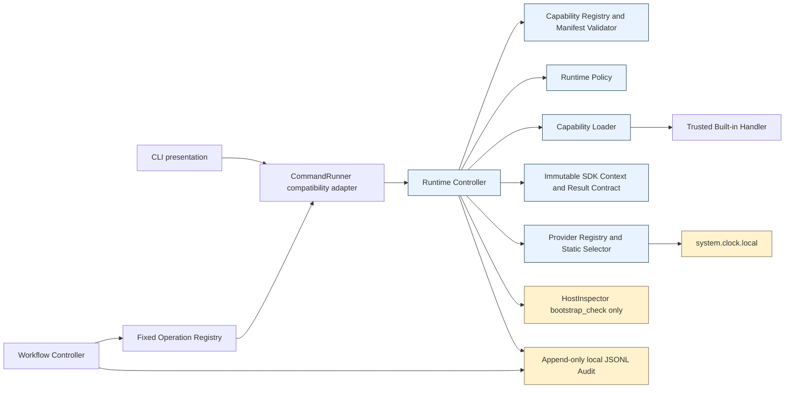
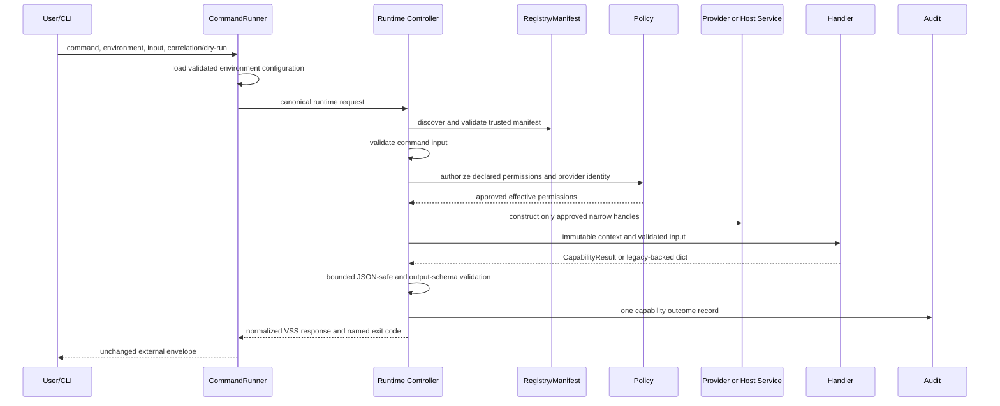
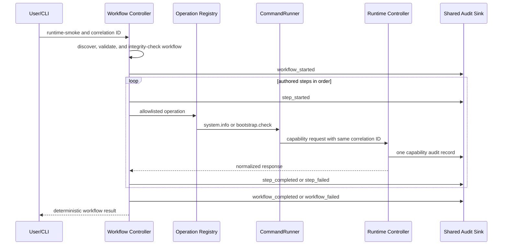

# M2 Architecture Checkpoint

**Review date:** 2026-08-01

**Reviewed main commit:** `1311914797f4e63fcec256da538cbe84a9db1491`

**Decision:** Accept M2 after the focused output-normalization correction in this review

**Scope:** M2.1 through M2.5

## 1. Executive summary

M2 is accepted. The implemented runtime is a small, local-first control plane
for repository-owned capabilities: supported CLI and workflow paths converge on
the Runtime Controller for manifest and input validation, policy authorization,
handler loading, result normalization, named exit codes, and capability audit.
Provider access is exact-identity scoped, workflow selection is a fixed
two-operation allowlist, and `bootstrap.check` receives only a narrow
runtime-owned inspection interface.

The review found no Critical or High findings. It found one Medium correctness
defect: the legacy-backed `system.info` capability result was schema-checked but
was not subject to the SDK's bounded JSON-safe validator. A nested arbitrary
Python object could therefore receive a nominal runtime success and fail later
during CLI serialization. This review applies the existing validator to all
non-SDK capability results and adds a regression test. Valid responses and all
public contracts are unchanged.

Two remaining Medium risks do not block M2 because all present effects are
local and read-only: Python thread timeouts cannot forcibly stop a running
handler, and the local JSON Lines audit has no retention, rotation, tamper
resistance, or durability guarantee. These become preconditions before
effectful capabilities, remote providers, or production operation. Low findings
cover manually synchronized workflow/runtime allowlists, broad authorization of
the harmless built-in clock to any trusted built-in that declares it, and
single-slice clock/host binding logic in the controller.

## 2. Reviewed scope and perspectives

The review examined ADR-0010; `src/vss_runtime`, `src/vss_capabilities`,
`src/vss_workflows`, and `src/vss_providers`; all built-in capability, provider,
and workflow manifests and handlers; schemas; command-engine routing; policy;
audit; host inspection; M2 tests; the threat model; dependency locks; component
admission; SBOM/provenance generation; and release-artifact controls.

The review used distinct evidence questions rather than implementation
authorship as an approval signal:

| Perspective | Independent conclusion |
| --- | --- |
| Runtime Architect | Controller authority and component boundaries are adequate for M2; timeout cancellation and single-slice binding are future constraints. |
| Product Security Reviewer | Built-in roots, safe YAML, path containment, exact provider identity, deny-by-default policy, safe results, and fail-closed audit are effective within the trusted-Python boundary. |
| Capability SDK Consumer | Context and result contracts are small and testable; the corrected controller now normalizes SDK and legacy-backed results consistently. |
| Workflow Engine Reviewer | Sequential ordering, stop-on-failure, skipped results, fixed operation admission, correlation, and lifecycle audit are deterministic. |
| Provider-Abstraction Reviewer | The clock contract is vendor-neutral and statically selected; a second provider type will require generalizing controller binding without importing a vendor SDK. |
| Legacy Compatibility Reviewer | `bootstrap.check` CLI syntax, output, correlation, dry-run, and result semantics are preserved through one capability implementation. |
| OSS/Supply-Chain Reviewer | M2 added no external dependency or vendor SDK; existing admission, locks, vulnerability/license policy, SBOM, provenance, and artifact gates cover the dependency set. |
| Independent Verification Reviewer | Supported and failure paths have direct deterministic evidence; no duplicate acceptance suite is needed. |

## 3. Architecture diagram

Responsibilities are distinct:

- the command engine owns legacy discovery, configuration loading, correlation
  creation, compatibility routing, and CLI response compatibility;
- the Runtime Controller owns every supported capability execution decision;
- the SDK owns author-facing context, bounded JSON data, result, error, and
  testing contracts;
- the workflow controller owns sequential orchestration and workflow audit but
  delegates each operation execution;
- the provider registry/selector owns trusted provider discovery, integrity,
  static selection, and initialization;
- `HostInspector` owns fixed read-only host probes and exposes no generic
  subprocess or filesystem object.

## 4. Execution-path diagrams

### Direct and compatibility CLI

### Sequential workflow

There is no circular routing. Capability handlers do not call the command
runner or workflow controller. The workflow-to-command-runner dependency is a
compatibility coupling, but both currently admitted operations are runtime
capabilities. The runtime has no dependency on CLI parsing or rendering.

## 5. Trust boundaries

| Boundary | Untrusted or fallible input | Controls | Residual limitation |
| --- | --- | --- | --- |
| Capability manifest | YAML, identity, schemas, entry point, permissions | `safe_load`, strict schema, version checks, direct trusted root, canonical containment, duplicate rejection, digest recheck | Repository-approved Python is trusted in-process. |
| Capability handler | Result, exception, attempted context misuse | handler identity/API binding, immutable bounded context, timeout, bounded JSON-safe result, output schema, fixed errors | A malicious built-in can import Python/OS modules; this is not a sandbox. |
| Workflow manifest | YAML, operations, inputs, timeouts | safe YAML, strict schema, 32-step maximum, fixed operation allowlist, no expressions/shell/includes/recursion, digest recheck | Allowlist synchronization is manual. |
| Provider manifest/code | identity, API, path, factory, output | safe YAML, fixed built-in root, path containment, manifest and implementation digests, static exact identity, immutable metadata/handles, output normalization | Built-in provider Python is trusted and unsandboxed. |
| Host inspection | PATH results, executables, stdout, local sockets | fixed names and argument tuples, canonical approved roots, root ownership, non-writable mode, absolute argv, no shell, empty environment, timeout, bounded normalized versions, fixed `/proc/1/comm` and ports | Loopback connect does not detect every interface-specific bind conflict; Snap symlinks resolving outside approved roots fail closed. |
| Audit sink | paths, injected strings, filesystem failure | trusted-root containment, `O_NOFOLLOW`, `O_APPEND`, structured JSON encoding, modes 0700/0600, no inputs/outputs, failure changes operation to failure | Local users with sufficient access can alter/delete records; growth is unbounded and writes are not fsync-backed. |
| Supply chain | PyPI, Actions, OCI, OpenTofu providers, host components | exact pins/hashes/digests, component approval, license/vulnerability policy, SBOM, provenance, artifact and secret gates | Mutable APT repositories and unsigned provenance consumption remain documented risks. |

Dynamic third-party capabilities and providers remain unsupported. Discovery is
repository-local only; there are no downloads, installed-package entry points,
remote workflow sources, marketplace hooks, or user-provided Python paths.

## 6. Compatibility matrix

| Supported path | Controller authority | Response/correlation | Authorization | Audit evidence | Verdict |
| --- | --- | --- | --- | --- | --- |
| `vss run system.info` | Runtime Controller | Envelope v1; supplied/generated ID preserved | no permissions | one capability record | Pass |
| `vss run runtime.echo` | Runtime Controller + SDK | Envelope v1; bounded input/output | no permissions | one input/output-free record | Pass |
| `vss run runtime.time` | Runtime Controller + provider selector | Envelope v1; normalized UTC | exact clock requirement approved | one record with provider metadata, not provider output | Pass |
| `vss bootstrap check` | CommandRunner compatibility route to Runtime Controller | Pre-migration structure, dry-run, exit behavior, and correlation preserved | capability-specific `filesystem_read`, `subprocess` | exactly one capability record | Pass |
| `vss run bootstrap.check` | Runtime Controller | Same output contract as legacy form | same capability policy | exactly one capability record | Pass |
| `vss workflow run runtime-smoke` | Runtime Controller per step | Workflow result v1; one shared correlation ID | no workflow-added privilege | two capability records plus workflow/step lifecycle | Pass |

Representative deterministic bootstrap fixtures cover tools available, both
tools unavailable, inaccessible Docker daemon, WSL with systemd running or
unavailable, ports available, and a port conflict. Probe unavailability remains
successful check data, matching the legacy contract; actual runtime/validation
failures use named nonzero exits.

## 7. Permission matrix

| Capability | Manifest request | Independently allowed policy | Exposed authority |
| --- | --- | --- | --- |
| `system.info` | none | none needed | immutable legacy execution context; safe system metadata only |
| `runtime.echo` | none | none needed | immutable SDK context and bounded JSON input |
| `runtime.time` | `provider_access` plus `system.clock.local` API 1 requirement | built-in provider category and exact identity allowlists | non-enumerable clock contract only |
| `bootstrap.check` | `filesystem_read`, `subprocess` | exact capability permission map | one `bootstrap_check()` method; fixed probes only |

The model is deny by default: unknown categories invalidate a manifest;
known-but-unapproved categories return `PERMISSION_DENIED` (13); provider
requirements and `provider_access` must appear together; and provider identity
authorization is separate. A declaration is not authorization. Capabilities
cannot enumerate providers or retrieve an undeclared handle through the SDK
context. Python import restrictions are not claimed as a sandbox boundary.

## 8. API and schema version matrix

| Contract | Current version | Independent enforcement |
| --- | --- | --- |
| Capability manifest schema | 1 | JSON Schema plus explicit manifest loader check |
| Runtime API | 1 | capability and workflow loaders check independently |
| Capability SDK API | 1 | manifest loader and handler attribute binding both check |
| Provider manifest schema | 1 | provider schema plus provider manifest loader check |
| Provider API | 1 | provider manifest loader and capability requirement selector check |
| Workflow schema | 1 | workflow schema plus explicit workflow loader check |
| External response envelope | 1 | controller/command response construction and structural tests |
| Audit record | 1 | deterministic code-owned fields; no standalone JSON Schema yet |

Existing capability manifests remain valid without `sdk_api_version` or
`required_providers`; those optional fields activate independent SDK/provider
checks when present. No version number changes are warranted by this review.

## 9. Acceptance-test evidence

No duplicate acceptance suite was added. Existing production-path tests already
form the required matrix:

| Evidence | Controls demonstrated |
| --- | --- |
| `tests/runtime/test_runtime_kernel.py` | discovery, manifest/schema/runtime versions, input, permissions, loader integrity, path/symlink/import controls, response, correlation, timeout, audit modes/failure/injection, corrected legacy result normalization |
| `tests/sdk/test_capability_sdk.py` | SDK version/identity binding, immutable context, bounded JSON, deterministic harness, policy denial, safe exception/error/output behavior |
| `tests/providers/test_provider_abstraction.py` | static exact selection, provider schema/API, substitution/integrity, access denial, non-enumerable immutable handle, fake clock, safe provider audit/output/failures |
| `tests/workflows/test_workflow_engine.py` | trusted workflow discovery, versions, operation admission, sequential lifecycle, correlation, stop/skip, timeout, audit, unsafe YAML/input/path rejection |
| `tests/runtime/test_bootstrap_check_capability.py` | legacy/direct convergence, golden structures, dry-run/correlation, one audit, workflow runtime path, permission inflation, fixed probes, unsafe resolution, timeout, malformed output, exception filtering |
| `tests/command_engine` | unchanged legacy registry, CLI envelope, named exits, configuration and non-migrated command behavior |
| `tests/security/test_supply_chain.py` | adversarial Action/image/exception/dependency/license, lock, SBOM, artifact, provenance, and secret gates |

Failure evidence maps safely:

| Failure | Named exit | Evidence/result |
| --- | ---: | --- |
| capability not found | `UNKNOWN_COMMAND` 12 | runtime registry test |
| invalid manifest | `INVALID_CONFIGURATION` 10 | schema/YAML/entry-point tests |
| unsupported Runtime API | `INVALID_CONFIGURATION` 10 | runtime manifest tests |
| unsupported SDK API | `INVALID_CONFIGURATION` 10 | SDK manifest/handler tests |
| permission denied | `PERMISSION_DENIED` 13 | runtime, SDK, provider, and bootstrap tests |
| provider unavailable | `NOT_READY` 22 | provider lifecycle/initialization tests |
| provider API mismatch | `INVALID_CONFIGURATION` 10 | provider API tests |
| invalid capability input | `INVALID_INPUT` 11 | runtime and SDK input tests |
| workflow not found | `WORKFLOW_NOT_FOUND` 31 | workflow registry test |
| invalid workflow | `INVALID_WORKFLOW` 32 | workflow schema/YAML tests |
| unsupported workflow version | `UNSUPPORTED_WORKFLOW_VERSION` 33 | workflow version tests |
| unknown workflow operation | `UNKNOWN_WORKFLOW_OPERATION` 34 | allowlist/recursion tests |
| step failure and later skip | `WORKFLOW_EXECUTION_FAILURE` 35 | stop-and-skip test |
| workflow timeout | `WORKFLOW_TIMEOUT` 36 | workflow timeout test |
| capability audit failure | `INTERNAL_ERROR` 30 | runtime audit failure tests |
| workflow audit failure | `WORKFLOW_INTERNAL_ERROR` 37 | workflow audit failure test |
| host execution deadline | `TIMEOUT` 21 | migrated capability timeout test |
| probe-local timeout | success with unavailable check | compatibility behavior; no raw output or exception |
| unsafe executable resolution | `EXECUTION_FAILURE` 20 | host boundary adversarial test |
| manifest/implementation substitution | `INVALID_CONFIGURATION` 10 | capability and provider digest tests |

The exact CLI checks for `system.info`, `runtime.echo`, and `runtime.time` passed
in this review environment. The sandbox intentionally exposes `/usr/bin` tools
as owned by `nobody`, so the real-host bootstrap workflow failed the required
root-ownership check. Deterministic bootstrap and workflow fixtures passed, and
the exact real-host CLI workflow test passed on GitHub main CI. No trust check
was weakened to accommodate the sandbox.

## 10. Security findings

### Critical

None.

### High

None.

### Medium M2-SEC-01 — Legacy-backed results were not bounded (corrected)

- **Evidence:** The Runtime Controller called `validate_output` only for
  `CapabilityResult`; the non-SDK `system.info` path accepted any nested Python
  object inside a dict after JSON Schema evaluation.
- **Impact:** A defective trusted legacy handler could be marked successful and
  then fail outside the controller during JSON serialization, bypassing
  deterministic result normalization and safe failure classification.
- **Correction:** Apply the existing bounded JSON-safe output validator to
  non-SDK capability results and test arbitrary-object rejection through the
  production controller.
- **Public contract:** No valid response changes. Previously invalid output now
  becomes safe `EXECUTION_FAILURE` (20) inside the controller.
- **M2 blocker:** Yes before correction; resolved by this review.

### Medium M2-SEC-02 — Timeout cancellation is cooperative only

- **Evidence:** `ThreadPoolExecutor` timeout calls `future.cancel()`, which
  cannot stop a handler that is already running.
- **Impact:** A future effectful or malicious in-process handler could continue
  work after the caller receives `TIMEOUT` and after the timeout audit record.
- **Recommended correction:** Before admitting effectful, remote, or
  untrusted-adjacent capabilities, define cancellation semantics and use a
  controllable isolation boundary or effect APIs that enforce deadlines.
- **M2 blocker:** No. Current timed operations are trusted and read-only; ADR-0010
  already records cancellation guarantees as unresolved.

### Medium M2-SEC-03 — Local audit retention and integrity are undefined

- **Evidence:** Audit uses one append-only JSON Lines file with restrictive
  modes but no rotation, size cap, fsync, integrity chain, external sink, or
  retention policy.
- **Impact:** Long-running use can exhaust local storage; privileged local
  actors can alter/delete evidence; a power loss may lose recent writes.
- **Recommended correction:** Define retention and maximum size before
  production use, then add safe rotation and an integrity/durable sink design
  before audit is relied on for compliance or remote execution.
- **M2 blocker:** No. M2 explicitly defines local audit as initial and not
  tamper-proof.

### Low M2-SEC-04 — Built-in clock authorization is category-global

- **Evidence:** Default policy allows `provider_access` for built-ins and exact
  identity `system.clock.local`; it is not restricted to `runtime.time` as the
  host permissions are restricted to `bootstrap.check`.
- **Impact:** A newly reviewed built-in that declares the exact clock can use it
  without adding a capability-specific policy entry. The present clock exposes
  no credentials or network effect.
- **Recommended correction:** Require capability-specific provider grants before
  adding any credentialed, remote, costly, or mutable provider.
- **M2 blocker:** No.

Security reconciliation found no bypass in supported paths for safe YAML,
manifest/path validation, symlink containment, constrained import paths,
provider substitution, subprocess argument selection, input/output bounds,
secret filtering, or audit injection. Direct imports by malicious built-in
Python remain possible and are explicitly outside the isolation guarantee.

## 11. Maintainability findings

### Low M2-MAINT-01 — Workflow/runtime allowlists are manually synchronized

- **Evidence:** `ALLOWED_OPERATIONS` and `RUNTIME_CAPABILITY_COMMANDS` are
  separate code-owned sets; workflow execution delegates through
  `CommandRunner`.
- **Impact:** A future workflow operation could accidentally name a legacy
  command and bypass Runtime Controller policy while still passing workflow
  admission.
- **Recommended correction:** Before adding a workflow operation, add an
  invariant that the workflow allowlist is a subset of runtime capability
  commands, or inject a runtime-only operation executor.
- **M2 blocker:** No; both currently allowed operations are runtime capabilities.

### Low M2-MAINT-02 — Controller binding contains single-slice knowledge

- **Evidence:** The controller checks provider type `clock`, imports the local
  clock identity, and injects host inspection by exact `bootstrap.check`
  identity and permission set.
- **Impact:** A second provider type or host-inspection consumer requires a
  controller edit, increasing the risk that the kernel accumulates domain
  binding logic.
- **Recommended correction:** Generalize only when the second concrete slice
  exists, using code-owned contract binders that remain policy-mediated and do
  not load arbitrary modules.
- **M2 blocker:** No; refactoring now would be premature.

### Low M2-VER-01 — Exact CLI tests depended on host executable ownership (corrected)

- **Evidence:** Command and workflow CLI tests required successful real-host
  `bootstrap.check`; the review sandbox correctly rejects `/usr/bin` tools
  presented as owned by `nobody`.
- **Impact:** Secure fail-closed behavior caused environment-dependent test
  failures even though deterministic controller-path fixtures proved success.
- **Correction:** Keep deterministic success assertions in fixture-backed tests;
  make subprocess CLI tests verify parsing, schema, correlation/steps, and a
  named host-dependent success or execution-failure classification.
- **Public contract:** None; tests only.
- **M2 blocker:** No; corrected for verification portability.

### Observation M2-MAINT-03 — Intentional compatibility stub

The registered legacy `bootstrap.check` handler raises if called directly;
`CommandRunner` routes the name to the Runtime Controller. This is an
intentional dead handler path preserving list/describe compatibility and
preventing an unaudited direct legacy invocation. Keep it until Phase 4 removes
legacy registration.

### Observation M2-MAINT-04 — Layer-specific status vocabulary

Capability responses use `success`/`error`; workflow state uses
`succeeded`/`failed`/`skipped`. Translation is explicit and tested. It is a
minor cognitive cost, not a correctness defect and not grounds for a contract
change.

There are no dependency-injection containers, decorators hiding registration,
metaclasses, global mutable capability/provider registries, remote import
machinery, or unbounded SDK input/output structures. Registry discovery is
recomputed rather than cached, favoring integrity simplicity at current scale.

## 12. Performance and resource observations

An in-process local benchmark on this commit used four capabilities, one
provider, a temporary audit sink, a deterministic host inspector, and ten
sequential smoke workflows. Results are indicative, not release SLOs:

| Operation | Mean observed time |
| --- | ---: |
| capability discovery and validation | 11.14 ms |
| provider discovery and validation | 0.93 ms |
| repeated Git commit lookup | 2.11 ms |
| one audit append | 0.04 ms |
| `system.info` controller execution | 16.75 ms |
| deterministic `runtime-smoke` | 35.71 ms |

These values do not justify caching. Reassess if discovery exceeds 50 ms at the
95th percentile, capability count approaches 100, audit append exceeds 5 ms,
or workflow orchestration becomes material relative to domain work. Any cache
must preserve manifest/implementation substitution detection. Git metadata
lookup is currently a measurable but small per-execution subprocess; capture it
once per immutable process revision only if profiling shows material load.

The audit file grows without bound. Establish retention and a storage budget
before sustained or production use; 100 MiB is a reasonable operational review
trigger, not an implemented limit or policy.

## 13. Remaining risks

- trusted built-in Python can deliberately import OS, provider implementation,
  or other modules and is not sandboxed;
- timed-out Python threads may continue running;
- audit is local, mutable by privileged users, not fsync-backed, and unbounded;
- provider authorization must become capability-specific before sensitive
  providers are admitted;
- workflow/runtime allowlist drift needs an invariant before expansion;
- capability/provider lifecycle and Python compatibility strings are recorded
  but not yet used for rich range negotiation;
- loopback connect checks do not model every bind conflict;
- Snap-resolved executables outside canonical approved roots fail closed and
  may reduce tool compatibility;
- source commit metadata is unavailable outside a Git checkout and is not a
  signature or provenance proof.

## 14. Deferred functionality

The implementation correctly defers autonomous AI planning, agents,
ReasoningProvider implementations, vendor SDKs, remote or third-party plugins,
dynamic downloads, signing and revocation, marketplaces, DAG scheduling,
parallelism, retries, rollback/compensation, remote workers, distributed event
buses/state, production databases, additional command migration, and
movie-production behavior.

There is no hidden vendor lock-in. `ClockProvider` is a local standard-library
contract, capability code imports provider-neutral protocols, and the kernel
contains no proprietary SDK or credential model. A future `ReasoningProvider`
can follow the same manifest, exact-identity policy, narrow-handle, normalized
result, and safe-audit pattern without embedding a vendor in the kernel. Its
admission must first address capability-specific grants, credentials, network
destinations, cost/timeout semantics, and process isolation.

## 15. M2 completion recommendation

**Accept M2.** The one blocking Medium defect is corrected without changing a
valid public contract. No Critical or High findings remain. The remaining
Medium and Low findings are explicit constraints on future expansion rather
than failures of the current read-only local vertical slices.

## 16. Preconditions for the next milestone

Before the next milestone expands effects or trust, require:

1. the corrected all-capability result-normalization regression to remain
   green;
2. a capability-specific grant for every sensitive or remote provider;
3. an invariant preventing workflows from admitting non-runtime operations;
4. explicit deadline/cancellation semantics before effectful handlers or
   providers;
5. credential, network-destination, cost, redaction, and audit rules before a
   `ReasoningProvider` implementation;
6. audit retention/storage limits before sustained operation, and a durable
   integrity design before compliance reliance;
7. a separate security decision for any third-party code, including signing,
   provenance, revocation, trust roots, and process isolation;
8. vertical-slice evidence before generalizing provider or host-service binding;
9. continued compatibility tests for legacy commands and no additional
   migration by implication; and
10. full supply-chain admission for every new external component.
