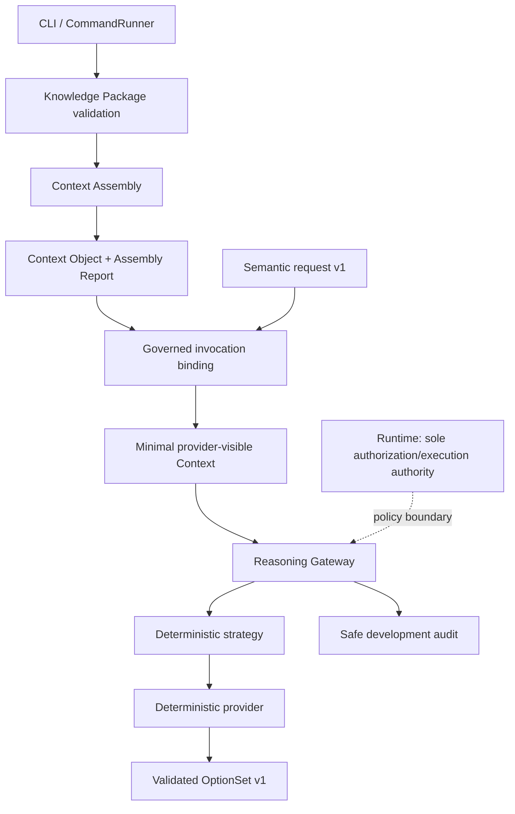

# M3 Context–Reasoning Integration Checkpoint

## Review metadata

- Reviewed main: `1c19e9350444e7ffdf2df3f3f14265880cd03648`
- Scope: M3.1–M3.6 governed local knowledge-to-reasoning chain
- Review branch: `review/m3-context-reasoning-integration-checkpoint`
- Date: 2026-08-03

## Executive verdict

**Accepted with non-blocking findings — proceed to the first movie-domain
vertical slice.**

The implemented chain is coherent, bounded, deterministic, and non-authorizing.
No current Critical or High defect was found. Production controls such as signed
artifacts, durable audit, persistent revocation, isolation, and external-provider
data governance remain correctly deferred.

## Current integration

Knowledge, Context, invocation metadata, and OptionSets are inert. The
Assembly Report and audit are governance-only. The provider-visible view is the
only Context representation crossing the provider boundary. No Context cache,
external provider, retrieval, Plan IR, approval, or execution component exists.

## Authority matrix

| Component | Validate | Register/select | Authorize/approve | Execute/retrieve | Audit | Authority |
|---|---:|---:|---:|---:|---:|---|
| Runtime | yes | no | yes | yes | delegates | sole authority |
| Knowledge/Context registries | yes | exact contracts | no | no | safe metadata | known only |
| Knowledge builder/package | yes | no | no | no | safe metadata | inert |
| Context assembler/report | yes | deterministic selection | no | no | safe metadata | narrows only |
| Semantic registry | yes | exact contracts | no | no | optional | validation only |
| Reasoning Gateway | yes | exact implementation | no | invokes admitted provider | yes | non-authorizing |
| Invocation binding | yes | no | no | no | bound metadata | immutable association |
| Strategy/provider | yes | no | no | no external effects | no | deterministic generation |
| OptionSet | yes | no | no | no | no | inert result |
| CLI/CommandRunner | parse/map | no | no | no | no domain semantics | routing only |

## Contract and registry coherence

M3 preserves semantic request envelope v1 and OptionSet family v1. Exact admitted
relationships are:

`generate_options/1` → `option_set/1` → `generate_options_context/1` →
`context_object/1`, with `reference_note/1` and `knowledge_package/1` admitted
under `local_validation_context`, context purpose
`generate_options_local_validation`, and deterministic local policy v1.

Registries remain independent and repository-built. No latest, wildcard,
implicit semver, arbitrary handles, or God Registry was introduced.

## Successful execution trace

1. CLI reads bounded strict JSON semantic request and Context files.
2. Semantic Registry validates request v1; Context Registry validates Context v1.
3. Gateway checks exact task/family/purpose/project/environment/classification
   and correlation/request ID bindings.
4. Context integrity and expiry are checked; the deterministic fixture clock is
   admitted only for the committed content digest. Ordinary calls use UTC.
5. Current policy-owned revocation snapshot checks each selected item and source
   identity before delivery.
6. Strategy/provider identities are resolved exactly.
7. A recursively snapshotted provider view is formed from selected notes,
   evidence identifiers, conflicts, uncertainty, and limitations.
8. Provider-view and invocation-binding digests are computed.
9. The deterministic provider is called once; it cannot retrieve or resolve
   evidence.
10. Result schema and M3.2 semantic-honesty checks validate the OptionSet.
11. Safe audit records bind request, Context content, provider-view and
    invocation metadata without payloads.
12. The existing VSS response envelope is returned.

Any pre-provider failure produces zero provider calls; invalid Context never
falls back to context-free reasoning. Dry-run performs readiness checks and
produces no OptionSet.

## Binding and digest review

The request digest, Context-content digest, provider-visible digest, and
invocation-binding digest are distinct. The invocation binding covers request,
Context, provider view, task/result versions, purpose, project, environment,
classification, policy, strategy, provider/API, and budget. Event correlation
is kept outside semantic content digests. Repeated runs produced stable semantic
result digest `d45a2a1555f93bc7dd1b519cf3592faaadbbfabe10250e41024b59feba82cfc1`.

The full Context digest remains event-bound. Integrity digests are substitution
evidence, not authenticity, truth, approval, or authority.

## Provider minimization and blindness

The provider view contains only bounded selected note content and semantic
qualifications. It excludes the full Context envelope, Assembly Report,
packages, lineage graphs, paths, registries, revocation state, policy objects,
audit, Runtime, connectors, credentials, and provider-native messages.

Supported interfaces expose no file, network, subprocess, connector, capability,
workflow, or additional-Context handle. Trusted in-process Python is not a
sandbox; malicious trusted code could import modules outside the supported
contract.

## Context influence and semantic honesty

Context is not ignored: deterministic output records governed-context,
uncertainty, conflict-count, and qualification limitations. Instruction-like
note text remains ordinary data. Conflicts, uncertainty, omissions, and inert
evidence references remain qualified; no truth, completeness, feasibility, cost,
timing, quality, or approval claims are introduced.

## Temporal, revocation, and audit behavior

One invocation validation time governs fixture expiry and revocation decisions;
the committed fixture exception is bound to its exact content digest. Equality
at expiry is rejected. Revocation checks cover every selected item and its
source identity. Persistent revocation, signing, durable audit, retention, and
multi-host ordering remain deferred.

Reasoning audit is local JSONL, bounded and payload-minimized. Audit failure is
fatal and no success is emitted before result validation. Local JSONL has no
fsync durability, tamper resistance, rotation, or multi-host guarantees.

## Determinism, compatibility, and performance

Context-aware repeated invocations produced identical semantic result content
and digest. The 317-test local Python suite passed, including M3.1–M3.5 suites,
M3.6 integration tests, and M3.3 performance tests. `ci_safe` passed. Context-
free GenerateOptions, Context Assembly, standalone Context validation,
context-aware GenerateOptions, and dry-run all passed. No retries, fallback, or
unbounded provider calls exist; supported Gateway use is concurrency-safe.

## Findings

### Observation M3-INT-01 — trusted in-process execution

The provider is not sandboxed from malicious trusted Python. This is an accepted
local limitation and blocks external/untrusted providers, not local M3 work.

### Observation M3-INT-02 — production governance deferred

Durable tamper-evident audit, persistent revocation, authenticated Contexts,
privacy/residency enforcement, worker isolation, and recovery are prerequisites
for production effects and external providers.

No Critical, High, or material Medium findings remain.

## Mission alignment and Plan IR timing

M3 has delivered sufficient generic infrastructure. Further broad platform ADRs,
universal Context abstractions, and universal Plan IR should stop until domain
evidence exists. Plan IR is deferred. The preferred choice is a small inert
movie-domain result first, then design Plan IR from observed planning semantics.

The recommended first slice is deterministic scene breakdown and production
option generation: it exercises knowledge contracts, a dedicated Context family,
semantic result validation, uncertainty and continuity evidence, and future plan
inputs without execution or external services. Character continuity and shot
options are useful alternatives; schedule, costume, and music slices can follow
once domain ownership and evidence needs are clearer.

## Recommended roadmap

- ADR-0019: deterministic scene-breakdown architecture
- M4.1 scene knowledge contracts and fixtures
- M4.2 scene-specific Context family and mapping
- M4.3 deterministic scene-breakdown task/result
- M4 integration checkpoint
- Plan IR architecture only after these outputs demonstrate a shared planning
  requirement

## Validation and limitations

ADR validation, supply-chain validation, SBOM/provenance checks, focused M3
tests, complete Python tests, Context-free and Context-aware acceptance paths,
dry-run, package validation, Context validation, performance `ci_safe`, and
`git diff --check` passed on the reviewed baseline. Full external infrastructure,
production audit, process isolation, external AI, retrieval, databases, caches,
approval, execution, and movie implementation remain intentionally absent.

## Final decision

**Accepted with non-blocking findings — proceed to the first movie-domain
vertical slice.**
