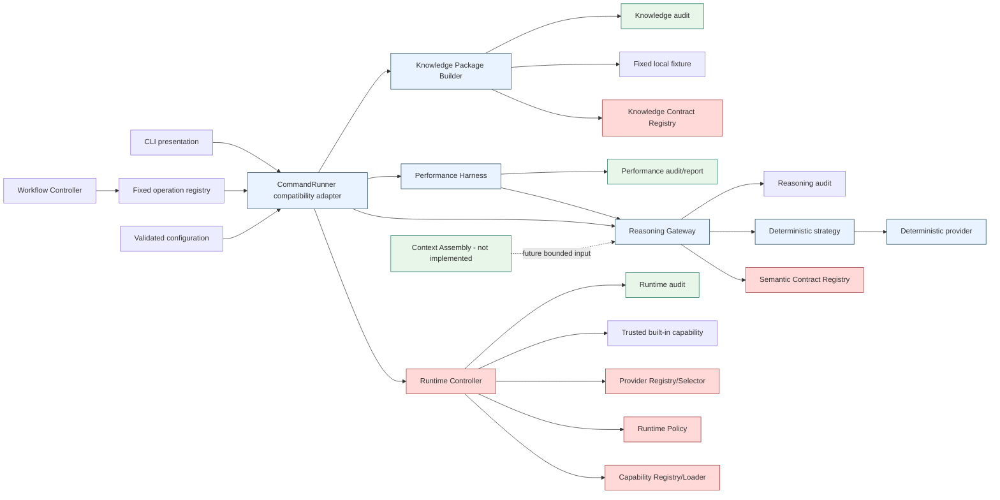

# M3 Platform Architecture Checkpoint

**Review date:** 2026-08-02
**Reviewed main commit:** `6ae92ce1e47b24ac2565a2bee8f0dbc3fc85f291`
**Review branch:** `review/m3-platform-architecture-checkpoint`
**Scope:** M1/bootstrap foundation, M2.1–M2.5, the prior M2 checkpoint, M3.1–M3.4, ADR-0010–ADR-0018, and readiness for the not-yet-implemented Context Assembly boundary.

## Executive verdict

**Accepted with non-blocking findings — proceed with conditions.**

The current platform is structurally coherent for its implemented scope. Runtime
is the sole execution and authorization authority; reasoning and knowledge are
inert, bounded, and non-authorizing; registries are federated; and the supported
local paths have direct deterministic evidence. No Critical or High finding was
identified. M3.5 may proceed as a local, deterministic, non-effectful Context
Assembly implementation subject to the conditions in this report.

The principal conditions are architectural guardrails, not a request for a
refactor: keep `CommandRunner` as a compatibility adapter, do not add effectful
operations or external providers before recovery and isolation gates exist, and
make context identity/version/digest binding and revocation revalidation
explicit before M3.6 integration.

## Evidence and review method

The review inspected source, schemas, manifests, tests, ADRs, threat model,
workflows, dependency locks, supply-chain policy, release-artifact tooling,
audit implementations, local fixtures, and the prior M2 checkpoint. Claims were
classified as implemented, tested, documented, inferred, limited, or deferred.

Local evidence on this workstation:

- 280 Python `unittest` cases passed across configuration, command, runtime,
  SDK, provider, workflow, semantic-contract, reasoning, performance, knowledge,
  IaC-contract, and security suites.
- All repository Bash suites passed; all shell files passed `bash -n`.
- ADR validation, supply-chain policy validation, and whitespace validation
  passed.
- M3.3 `ci_safe` generation and dry-run passed with eight requests, concurrency
  two, zero failures, valid audit records, and stable semantic content.
- M3.3 `laptop_small` (endurance disabled) passed with 25 requests, concurrency
  four, zero failures, valid audit records, stable semantic content, and about
  276.42 successful requests/second.
- Two M3.4 builds had identical source, item, and package-content digests;
  event-bound package digests differed as intended.
- M3.4 committed package validation passed.
- `bootstrap verify` and the workflow smoke path reached the expected Docker
  socket/IaC host limitation; no control was weakened to make them pass.
- `pytest` is not installed in the review environment; the repository CI uses
  `unittest`, which was run directly and passed.
- The unrelated untracked file
  `.local/secrets/development.auto.tfvars.example` was preserved untouched.

## Current-state architecture

Runtime Controller is the only implemented execution authority. Registry and
policy components validate and narrow; they do not authorize independently.
Reasoning, knowledge packages, performance reports, and audit records are
non-authorizing data/evidence. Context Assembly is explicitly future work and
is not depicted as implemented.

## Component inventory

| Component | Responsibility and interfaces | Authority/trust | Dependencies and dependents | Version/lifecycle, audit, tests, limitation |
|---|---|---|---|---|
| `vss_commands` | CLI parsing, compatibility routing, response envelope, named exits | presentation/adapter; trusted process | config, Runtime, Reasoning, Performance, Knowledge; depended on by users/workflows | envelope v1; no independent execution authority; command tests |
| `vss_runtime` | manifest resolution, input/output validation, policy, provider access, handler execution | sole implemented execution/authorization owner; trusted built-in Python | capability/provider registries, SDK, audit; called by CommandRunner | Runtime/capability APIs v1; runtime tests; no process sandbox |
| `vss_capabilities` | immutable SDK context/results and bounded JSON contracts | non-authorizing handler contract; trusted code executes only through Runtime | Runtime and built-in handlers | SDK API v1; SDK tests; in-process trust |
| `vss_providers` | exact built-in provider registration, integrity, selection, narrow handles | provider binding only; cannot authorize invocation | Runtime and capability manifests | provider API v1; provider tests; no third-party providers |
| `vss_workflows` | fixed manifest/operation discovery and sequential orchestration | orchestration only; delegates each operation to Runtime path | operation registry and CommandRunner; workflow audit | workflow v1; workflow tests; no general workflow language |
| `vss_reasoning_contracts` | semantic schemas, immutable values, canonicalization, registry | validation only; non-authorizing | Reasoning Gateway and tests | semantic identities/families v1; contract tests |
| `vss_reasoning` | policy-owned Gateway validation, strategy/provider resolution, result semantics, audit | reasoning boundary; cannot invoke capabilities/workflows | semantic registry, implementation registry, deterministic strategy/provider | GenerateOptions v1; reasoning tests; no external model |
| `vss_reasoning_strategies` | deterministic candidate generation | non-authorizing strategy | Gateway and deterministic provider | built-in v1; no runtime access |
| `vss_reasoning_providers` | deterministic provider implementation | non-authorizing provider | strategy | provider API v1; no AI/external effects |
| `vss_performance` | bounded real-Gateway concurrency, metrics, reports, audit verification | observer/invoker of approved Gateway; no authority | Reasoning Gateway and local audit | profiles v1; 43 tests; laptop evidence is not capacity evidence |
| `vss_knowledge_contracts` | knowledge schemas/models, registry, integrity, lineage, revocation validation | validation/known-contract authority only; non-authorizing | repository schemas and fixtures | item/package v1; 32 tests; no retrieval |
| `vss_knowledge` | fixed-fixture admission, normalization, package construction, policy, audit | governed preparation only; inert output | Knowledge Contract Registry and exact fixture mapping | package v1; 32 tests; no source connector |
| Configuration | validated environment configuration | configuration data, not authority | CommandRunner and Runtime | development/local profiles; config tests; no provider/schema override |
| Audit | append-only development JSONL evidence | no execution authority | Runtime, workflow, reasoning, performance, knowledge | event schemas are code-owned; local-only, no durability/rotation/tamper resistance |
| Future Context Assembly | package eligibility, deterministic selection, minimization, context validation | must remain non-authorizing | future Context Registry, Knowledge, semantic task mapping | ADR-0017/0018 only; not implemented |

## Dependency direction

| Dependency | Assessment |
|---|---|
| CLI → Runtime | Acceptable presentation/compatibility coupling. Runtime does not import CLI rendering. |
| CLI → Reasoning/Performance/Knowledge | Acceptable bounded routing. Domain logic remains in those packages. |
| Workflow → operation registry → CommandRunner | Acceptable compatibility coupling; workflow delegates instead of bypassing Runtime. |
| Runtime → capability/provider registries and SDK | Correct control-plane direction. |
| Providers → capabilities/workflows | No such dependency observed. |
| Semantic contracts → Runtime execution | Not present; validation remains separate. |
| Reasoning → capabilities/workflows/Knowledge | Not present. |
| Knowledge → reasoning providers | Not present. |
| Performance → real Gateway | Confirmed by implementation and M3.3 tests; no direct deterministic-provider primary path. |
| Audit → execution | Audit is called by operations and cannot invoke them. |
| Registry → registry mutation | No mutation path observed; ADR-0018 requires inert exact mappings. |

`CommandRunner` has accumulated explicit dispatch for Runtime, Reasoning,
Performance, and Knowledge (`src/vss_commands/runner.py:94-201`). This is a
compatibility adapter rather than a second authorization plane: Runtime,
Reasoning Gateway, Performance Harness, and Knowledge Builder retain their own
validation and failure semantics. It is a Medium future-drift risk if new domain
policy or orchestration is added there. M3.5 must keep it routing-only.

## Authority matrix

| Component | Validate | Register/resolve | Authorize | Approve | Execute/invoke | Source access | Expand authority | Audit |
|---|---:|---:|---:|---:|---:|---:|---:|---:|
| CLI | input shape | no | no | no | routes only | no | no | no |
| CommandRunner | envelope/config routing | command compatibility | no | no | delegates | no | no | response mapping |
| Runtime Controller | capability input/output | capability/provider | **yes** | no | **yes** | only approved narrow handles | no; narrows | **yes** |
| Capability Registry/Loader | manifest | **yes** | no | no | loads trusted code | no | no | metadata |
| Capability SDK | bounded values | no | no | no | handler contract only | only injected narrow handles | no | no |
| Provider Registry/Selector | provider contract | **yes** | no | no | initializes approved binding | no by itself | no | metadata |
| Workflow Controller | workflow/step | workflow operations | no | no | delegates | no | no | **yes** |
| Semantic Registry | semantic structure | **yes** | no | no | no | no | no | optional |
| Reasoning Gateway | request/result/semantic honesty | implementation resolution | policy checks for reasoning | no | reasoning only | no | no | **yes** |
| Strategy/provider | result generation | built-in only | no | no | no external effects | no | no | no |
| Performance Harness | report metrics | fixed profiles | no | no | invokes approved Gateway | no | no | verifies |
| Knowledge Registry/Builder | item/package/lineage | **yes** | admission policy only | no | no | exact fixture only | no | **yes** |
| Knowledge Package | own integrity/validation | no | no | no | no | no | no | data only |
| Future Context Assembly | context eligibility | future context registry | no | no | no | embedded package data only | no; only narrows | **yes** |
| Audit | record structure | no | no | no | no | no | no | evidence only |
| Configuration | config schema | no | no | no | no | no | no | optional |
| Approval architecture | approval artifact | future registry | Runtime-owned policy only | future approval decision | no | no | no | future |

The matrix has exactly one owner for execution/authorization: Runtime policy and
Runtime Controller. Registry admission means known, not authorized; active does
not mean approved for an invocation; a digest means integrity evidence, not
authenticity or authority.

## Representative traces

1. `vss run system.info`: CLI parses → CommandRunner loads environment → Runtime
   resolves fixed capability manifest → validates input → policy checks → loads
   trusted handler → validates output → writes audit → returns envelope v1.
2. `vss run runtime.echo`: same path, with schema-required `value`; missing value
   correctly returns `INVALID_INPUT` 11.
3. `vss run runtime.time`: Runtime resolves exact local clock provider, checks
   provider and capability permission, gives a narrow clock handle, validates
   output, audits, and returns UTC data.
4. `vss bootstrap check`: same Runtime path with narrowly scoped host-inspection
   method; host failures are bounded data or safe capability failure.
5. `vss workflow run runtime-smoke`: fixed workflow → fixed operation registry →
   CommandRunner → Runtime per step; stop/skip and lifecycle audit are tested.
6. `vss reasoning generate-options`: strict bounded JSON → semantic registry →
   exact task/purpose/classification/policy → exact strategy/provider → result
   semantic-honesty checks → reasoning audit → envelope mapping.
7. `vss performance reasoning`: fixed profile → bounded sliding execution window
   → real Gateway → semantic/audit verification → bounded report. It grants no
   production capacity or authorization.
8. `vss knowledge package build`: exact fixture identity → strict file/schema and
   source validation → item normalization → classification/purpose/freshness/
   revocation/lineage/integrity → package validation → safe audit.
9. `vss knowledge package validate`: bounded regular-file input → strict decode →
   registry/policy/digest/lineage/time/lifecycle validation → safe summary.
10. Future knowledge → context → reasoning: not implemented. ADR-0017 requires
    selection, minimization, purpose/classification/freshness/revocation checks,
    preserved conflict/uncertainty/provenance, bounded typed Context Object, and
    Runtime-owned delivery without provider source access.

## Policy ownership and coherence

| Policy | Owner | Inputs/outputs | Version/immutability | Failure behavior |
|---|---|---|---|---|
| Runtime permission/provider policy | Runtime Controller | manifest permissions and exact provider identities → authorization | built-in immutable snapshot | deny or configuration failure |
| Capability manifest policy | Capability Registry/Loader | repository manifest → admitted capability | schema/API/digest checks | fail closed |
| Workflow operation admission | Workflow Registry | fixed workflow operation identity → allowed operation | repository-owned, bounded | unknown operation/step failure |
| Reasoning policy | Reasoning Gateway | task/family/environment/classification/purpose/implementation identities → allowed combination | immutable policy/registry | unauthorized or invalid input |
| Performance profile policy | Performance package | exact profile → bounded workload | immutable repository profiles | invalid profile; no overrides |
| Knowledge source/purpose policy | Knowledge Builder/Registry | exact fixture, purpose, classification, trust, freshness, revocation → package eligibility | immutable repository snapshot | invalid/denied/stale/revoked |
| Future context policy | ADR-0017; not implemented | package/task/family/purpose/classification/freshness → selected context | must be immutable per invocation | fail closed |

Policy fragmentation is currently manageable because each policy owns a bounded
domain and no generic policy engine has been introduced. The main coherence rule
is that validation and registration never substitute for Runtime authorization.
No supported CLI or environment variable selects providers, strategies, schema
roots, arbitrary implementations, or lifecycle states.

## Contract and registry conformance

| Domain | Current identity/version | Schema/loading | Resolution/compatibility | Digest/bounds/immutability | Tests/deviation |
|---|---|---|---|---|---|
| Capability | manifest/API v1 | repository YAML/JSON Schema, safe loading and containment | exact built-in identity/API | manifest digests, bounded manifests, immutable records | runtime/SDK tests; older M2 domain-specific patterns |
| Provider | provider manifest/API v1 | fixed manifest root, integrity and API checks | exact type/identity/API | manifest/implementation digests, narrow handles | provider tests; no dynamic providers |
| Workflow | workflow v1 | safe YAML, fixed root, bounded steps | fixed operation allowlist | manifest digest, bounded sequential state | workflow tests; allowlist synchronization is manual |
| Semantic | semantic registry v1, task/family v1 | four exact repository schemas, strict loader | exact identity/version; no latest | canonical content/registry digests, bounded nodes | 25 contract tests; conforms strongly to ADR-0018 |
| Knowledge | item/package v1; `reference_note/1` | fixed schema mappings, no-follow bounded reads | exact fixture/purpose/family | source/item/package/lineage digests, immutable models | 32 tests; no retrieval or external revocation service |
| Performance | profiles/report v1 | fixed profile objects and strict report schema | exact profile identity/version | report/profile integrity, hard request/concurrency/size limits | 43 tests; report format is domain-owned, no separate registry needed |
| Context (future) | conceptual per ADR-0017 | not implemented | must use exact federated mappings | must define context/selection/event digest domains | no implementation; M3.5 deliverable |

No pre-ADR-0018 registry is declared defective solely for historical differences.
Security-significant common obligations are already strong in semantic,
knowledge, and performance domains. Capability/provider/workflow domains should
be assessed during material changes, not broadly rewritten.

## God-object and God-registry assessment

No current God Registry or universal Contract Object was found. Semantic and
knowledge envelopes use one typed payload; package and performance reports are
bounded domain objects; ADR-0017 prohibits a universal Context Object; ADR-0018
prohibits a universal registry, lifecycle service, metadata bag, or base class.
The Runtime Controller is broad because it owns the single execution decision,
but its responsibilities remain runtime validation, policy, loading, execution,
and audit—not knowledge, semantic contract ownership, workflow grammar, or
provider policy.

The principal prevention rule is to stop adding generic fields to envelopes and
to stop routing domain policy through `CommandRunner`.

## Security architecture

The trusted-computing base is repository-approved in-process Python plus
validated repository manifests, schemas, fixtures, and pinned CI/build inputs.
This is appropriate for current read-only local operations, deterministic
reasoning, fixture knowledge, and performance testing. It is not sandboxing and
is not appropriate for effectful third-party code, credentialed providers,
remote plugins, destructive operations, or production media execution.

Current controls cover path traversal, symlink and special-file handling,
duplicate keys, non-finite numbers, bounded sizes/depth/nodes, fixed roots,
strict schemas, exact identities, safe errors, correlation binding, result
validation, semantic honesty, report no-clobber behavior, bounded concurrency,
and payload-minimized audit. CI pins Actions by SHA and images/providers by
digest, requires hashed Python locks, license/vulnerability/dependency review,
CodeQL, secret scanning, SBOM, provenance, and artifact validation.

Residual risks are documented rather than hidden: trusted Python is unsandboxed;
local audit is not durable or tamper resistant; host packages/APT remain less
reproducible than Python locks; and provenance consumer verification/signing is
deferred.

## Audit and observability

Runtime, workflow, reasoning, performance, and knowledge operations emit bounded
safe metadata with correlation/execution identities and status. Reasoning and
knowledge audit excludes semantic payloads, note bodies, packages, and raw
provenance. M3.3 verifies concurrent JSONL association and terminal records; M3.4
uses safe terminal evidence and treats audit failure as fatal.

Production limitations remain: local JSONL only, in-process synchronization,
no guaranteed `fsync`, no rotation or retention enforcement, no tamper
resistance, no external anchoring, and no multi-host ordering. These do not block
local inert M3.5 or M3.6, but they block production-sensitive use and must be
closed before durable effectful execution.

## Reliability, cancellation, and recovery

Current operations are bounded, local, read-only, or deterministic. Failures in
validation, policy, provider/handler execution, semantic validation, digest or
lineage checks, audit, and report writing map to non-success outcomes. M3.3
accounts for submitted work and shuts down its executor; M3.4 fails on audit or
integrity failure.

Cancellation is cooperative. A Python thread handler that ignores a timeout
cannot be forcibly stopped; this remains safe only while supported operations
are bounded and side-effect free/read-only. Before any effectful operation the
platform needs enforceable cancellation, process/worker isolation, durable
execution state, attempt/effect identities, idempotency or reconciliation,
credential containment, durable audit, and operator recovery.

Not yet demonstrated: retry safety for effects, restart continuation,
checkpoint persistence, partial artifact cleanup, reconciliation, or an
operator recovery workflow. A thin recovery vertical slice is required before
costly media generation, destructive operations, remote workers, or autonomy.

## Performance and concurrency

M3.3 exercises the real M3.2 Gateway, not the deterministic provider directly.
The `ci_safe` profile is eight measured requests at concurrency two with bounded
outstanding work. The local run completed eight successes, zero failures,
semantic digest match, valid audit records, and approximately 289 successful
requests/second with 4.806 ms mean latency. Dry-run completed separately at
approximately 895 successful readiness requests/second with no provider call.
High percentiles are correctly marked weak evidence for the eight-sample run.

These are deterministic laptop/CI micro-workload observations only. They do not
measure AI inference, media rendering, GPU throughput, long-running work,
distributed scaling, or external-provider capacity. No production SLO or
capacity claim is supported.

## Efficiency and supply chain

Python runtime dependencies are `PyYAML==6.0.3` and `jsonschema==4.26.0`, with
hashed runtime/development/bootstrap locks. CI and local foundations also use
Ansible, OpenTofu, Docker, scanners, SBOM/provenance tooling, and pinned GitHub
Actions/images/providers. These are proportionate to the current infrastructure
and security scope; removing them would weaken controls. Host APT content,
Docker daemon administration, scanner databases, transitive maintenance, and
unsigned provenance verification remain accepted or pre-production risks.

The M3.4 `.secrets.baseline` entries are deterministic fixture digests and no
new dependency or exclusion was added. A full local detect-secrets invocation
against every tracked file reports pre-existing high-entropy lock/tool values;
the focused CI/changed-file scans and GitHub secret checks pass. This invocation
does not establish a new secret acceptance and is recorded as a tooling-scope
limitation, not silently corrected.

## Configuration, developer experience, and operability

Environment names are configuration-validated; implementation identities,
schema roots, fixture paths, providers, and strategies are repository-owned.
`.local` state is ignored and local secrets remain outside tracked content.
Errors retain safe envelopes and named exits; correlation IDs, contract/profile
identities, digests, and audit records provide useful diagnosis. A developer can
run the M3.2, M3.3, and M3.4 acceptance paths offline with the repository
environment, subject to Docker/OpenTofu host checks for bootstrap verification.

One local command example is intentionally input-bearing: `runtime.echo`
requires the schema field `value`; omitting it correctly returns exit 11. The
CLI therefore remains strict rather than silently inventing input.

## Compatibility and upgrade governance

| Surface | Current version/status | Compatibility conclusion |
|---|---|---|
| Runtime/capability API | v1 | preserved through M2 tests |
| Capability SDK | v1 | immutable context/result contract; tests pass |
| Provider API | v1 | exact provider identity/API checks |
| Workflow | v1 | fixed operation grammar and tests |
| Outer VSS response | v1 | named exits/correlation preserved |
| Semantic task/families | GenerateOptions/option_set v1 | exact registry and repeated digest evidence |
| Knowledge item/package | reference_note/knowledge_package v1 | independent validation and digest evidence |
| Performance profiles/reports | v1 | structural report evidence, no SLO gate |
| Context | not implemented | ADR-0017/0018 require independent versioning |

Contract upgrades, registry implementation upgrades, schema/validator upgrades,
policy changes, and dependency upgrades remain distinct. Validator upgrades must
test newly accepted/rejected data, remote-resolution behavior, canonicalization,
digest stability, and supported Python versions. No automatic latest or wildcard
resolution is allowed.

## Mission alignment and architecture-overbuild assessment

| Area | Mission classification | Assessment |
|---|---|---|
| Runtime/capability/provider/workflow foundation | necessary platform foundation | sufficiently complete for safe local read-only control paths |
| Semantic reasoning | governance/risk reduction plus early product capability | useful deterministic GenerateOptions slice; no autonomy claim |
| Performance laboratory | governance/risk reduction | proportionate structural evidence, not production capacity |
| Knowledge contracts/packages | governance/risk reduction and future product substrate | first inert local vertical slice; no retrieval/search overbuild |
| ADR/registry governance | governance/risk reduction | justified at current boundaries; must now slow down |
| Context Assembly | planned near-term architecture | not yet implementation; M3.5 should be small and concrete |
| Movie-domain behavior | missing/direct mission value | should begin after M3.6 rather than another generic layer |

The platform has significant architecture, but most of it protects irreversible
boundaries: authority, schemas, provenance, audit, supply chain, and bounded
execution. It has not yet accumulated a universal registry, context object,
policy engine, or production infrastructure. The risk is roadmap delay rather
than present overbuild. Guardrails: no general-purpose ADR without a demonstrated
need, utilities only after repeated evidence, architecture checkpoints at
milestones, and one movie-domain vertical slice after M3.6.

## M3.5 readiness

**Proceed.** ADR-0017 and ADR-0018 provide the required boundary and federated
governance. Knowledge packages already provide bounded immutable content,
classification, purpose, trust, freshness, revocation representation,
conflict/uncertainty, lineage, digests, and safe local audit. M3.5 must remain:

- local and deterministic;
- exact-package and exact-contract based;
- bounded in packages, items, bytes, duration, and transformations;
- non-retrieving and non-authorizing;
- deterministic in package/item ordering;
- explicit about required versus optional content;
- preserving classification, trust, provenance, freshness, revocation, conflicts,
  uncertainty, and omissions; and
- independently tested without modifying M3.1/M3.4 contracts.

## M3.6 readiness and decisions

M3.6 may proceed after M3.5 demonstrates a validated Context Object. Before
delivery to the Gateway, M3.6 must decide and test:

- embed versus Runtime-owned context reference without an arbitrary fetch handle;
- exact context identity/version/content-digest binding;
- correlation binding across request, context, result, and audit;
- provider-visible versus governance-only metadata;
- expiry and revocation revalidation immediately before delivery;
- context and reasoning budget interaction;
- preserved conflict/uncertainty semantics; and
- inert evidence-reference behavior.

These are contract-impact decisions and must not be smuggled into Context
Assembly implementation. The provider must never browse packages, resolve
evidence, request additional context, or broaden purpose.

## Production-readiness gates

| Capability | Required before enabling |
|---|---|
| M3.5 local Context Assembly | deterministic policies, bounded objects, current package validation, local audit, no effects |
| M3.6 local context-to-reasoning | context digest/version binding, expiry/revocation checks, correlation and audit association |
| External AI provider | credential containment, provider data policy, durable audit, cancellation, isolation, cost controls, privacy/licensing review |
| Effectful capability/destructive operation | process/worker isolation, enforceable cancellation, durable execution state, attempt/effect identity, idempotency/reconciliation, kill switch, recovery |
| Dynamic third-party plugin | signed/authenticated bundles, trust roots, provenance, dependency scanning, isolation/sandboxing, permissions, revocation, rollback, incident response |
| Long-running media/rendering | checkpoint/restart, artifact cleanup, durable state, resource quotas, observability, cost controls, recovery and reconciliation |
| Production-sensitive data/public publishing | production identity/authorization, durable tamper-evident audit, privacy/residency, retention/deletion, package authenticity, legal/licensing review, incident response |

## Findings

### Medium

**M3-ARCH-01 — CommandRunner control-plane drift**
**Affected:** `src/vss_commands/runner.py:94-201`.
**Evidence/impact:** one adapter dispatches Runtime, Reasoning, Performance, and
Knowledge operations. It currently maps inputs/errors and delegates correctly,
but further policy or orchestration would create a second control plane.
**Likelihood:** medium as milestones add domains.
**Mitigation:** domain packages own validation/policy; tests pass; no bypass was
found.
**Recommendation/timing:** keep future additions routing-only and review at
M3.5/M3.6; do not refactor in this checkpoint.
**Blocks:** M3.5 no; M3.6 no if preserved; production only if it gains authority.

**M3-REL-01 — Cooperative thread cancellation**
**Affected:** Runtime and legacy command execution.
**Evidence/impact:** `ThreadPoolExecutor.shutdown(wait=False)` and future
`cancel()` cannot stop a handler already running. A defective effectful handler
could outlive its timeout.
**Likelihood:** low for current bounded read-only built-ins; high if effects are
introduced without isolation.
**Mitigation:** bounded local operations, timeout tests, no effectful handlers.
**Recommendation/timing:** require enforceable cancellation/process isolation
before effects, external providers, or autonomy.
**Blocks:** M3.5 no; M3.6 local inert no; production effectful yes.

### Low

**M3-OPS-01 — Local audit durability and retention**
Local JSONL has no fsync, rotation, retention, tamper resistance, or host-wide
ordering. This is documented and does not block local M3.5; it blocks production
audit claims.

**M3-SEC-01 — Trusted in-process Python boundary**
Repository-approved built-ins can still import Python/OS modules. This is an
accepted local-development boundary, not sandboxing; it blocks unreviewed
third-party or credentialed code.

### Observations

- Bootstrap verification is host-dependent and currently fails on this machine
  because Docker socket access/IaC validation is unavailable. CI remains the
  authoritative clean-runner evidence.
- Laptop and CI performance evidence is not production capacity evidence.
- APT/host package reproducibility and provenance consumer verification remain
  deferred supply-chain work.
- Retry, restart recovery, checkpointing, reconciliation, and partial-artifact
  cleanup are not implemented because current operations are read-only or
  deterministic.
- Persistent revocation, production storage, package signing, cache invalidation,
  search, embeddings, connectors, external providers, and reasoning consumption
  are intentionally deferred.

No Critical or High finding remains. No correction to implementation code was
necessary for this checkpoint.

## Recommended first movie vertical slice

Begin after M3.6 with a deterministic **scene breakdown and production-options**
slice:

- one harmless committed screenplay/scene fixture;
- one separately versioned scene/reference knowledge family;
- one bounded scene-planning context family;
- one semantic task that returns structured scene-production options;
- explicit constraints, uncertainty, provenance, and no execution.

This offers more mission learning than another generic registry: it exercises
knowledge, context, semantic reasoning, conflicts, budgets, and local
reproducibility while avoiding external services, media binaries, credentials,
and irreversible operations. Character continuity is a good second slice; shot
rendering, schedules, music, and publishing should follow recovery and effect
gates.

## Roadmap recommendation

1. M3.5: implement only deterministic local Context Assembly.
2. M3.6: integrate validated context with GenerateOptions after explicit contract
   impact review.
3. Insert a recovery/effect-boundary checkpoint before any effectful capability,
   external provider, or long-running work.
4. Deliver the scene-breakdown movie vertical slice immediately after M3.6.
5. Defer Plan IR, approval, external providers, connectors, search, embeddings,
   distributed workers, and production infrastructure until their gates are met.

## Final decision

The platform is coherent and safe to continue investing in. M3.5 is approved to
proceed under the stated local/inert/bounded conditions. The architecture has
not accumulated a fundamental rewrite requirement, but it must now convert its
generic foundations into domain learning rather than adding more abstract
governance layers. No Context Assembly, AI provider, prompt, connector, search,
embedding/vector store, Plan IR, approval service, distributed infrastructure,
production audit, process isolation, or movie-production implementation was
introduced by this checkpoint.

## Validation status

Passed:

- all focused and complete Python `unittest` suites listed above;
- all Bash suites and shell syntax;
- ADR validation;
- supply-chain policy validation;
- schema/fixture validation through the M3.4 test suite;
- M3.2 deterministic generation and dry-run;
- M3.3 `ci_safe`, concurrent dry-run, and `laptop_small` without endurance;
- two M3.4 builds and committed package validation; and
- `git diff --check`.

Environment-limited:

- `bootstrap verify` could not complete Docker/IaC checks because this review
  environment lacks Docker socket access; it returned its documented safe
  diagnostic rather than a false success.
- The full-repository `detect-secrets-hook` invocation reports pre-existing
  high-entropy lock, tool, and component-digest values. Focused changed-file
  scanning, CI secret checks, and the existing baseline policy pass; no baseline
  or exclusion was changed by this checkpoint.

No implementation correction was required. This report is the only tracked file
added by the review branch.
