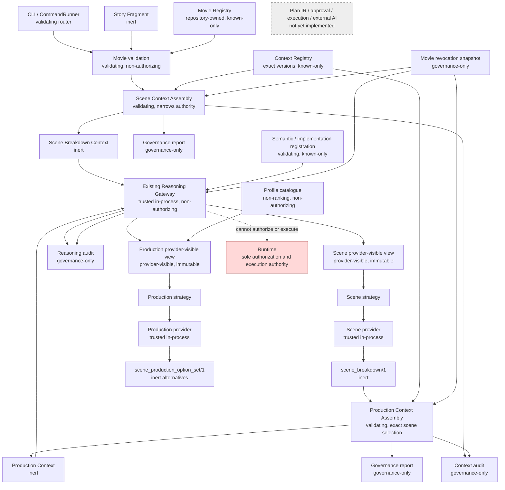

# M4 Movie-Domain Integration Checkpoint

## 1. Review metadata

- Review date: 2026-08-08
- Reviewed authoritative `main`: `dc85de4984f577cab4b3c0f2816261c996fda10e`
- Review branch: `review/m4-movie-domain-integration-checkpoint`
- Scope: ADR-0019, M4.1, M4.2, M4.3, and their integration with M3.1–M3.6
- Method: source/schema/test/CI inspection, successful and adversarial traces,
  repeated CLI execution, concurrency, audit/revocation review, and complete
  repository validation

This document is a point-in-time implementation checkpoint, not an ADR.

## 2. Scope

The review covers Runtime authority, Knowledge and Context architecture,
semantic contracts, the existing Reasoning Gateway, strategy/provider
admission, audit, revocation, CLI boundaries, both movie reasoning stages, the
Movie and Context registries, documentation, threat model, tests, CI, and
supply-chain controls. It does not design or implement Plan IR, approval,
execution, external AI, ranking, media generation, or the next movie feature.

## 3. Executive verdict

**Accepted with non-blocking findings — proceed with Character Continuity
architecture.**

M4 is an architecturally coherent vertical slice. Governed Story Fragment data
can become a deterministic, qualified Scene Breakdown and then bounded inert
production alternatives for one exactly bound scene. M4 reused the M3 Context,
Reasoning Gateway, provider/strategy, registry, audit, strict-loading, response,
and exit-code patterns rather than creating a second control plane.

The review found and corrected three tightly related High M4.2 integration
defects: missing Gateway expiry enforcement, a possible second terminal
reasoning-audit attempt after success-audit failure, and missing Scene Breakdown
Context audit. No contract, schema, semantic digest, feature, or authority was
added. No Critical or unresolved High finding remains.

Plan IR remains premature. Current artifacts are observations and advisory
alternatives; they contain no evidenced action sequence, dependency graph,
state transition, recovery, compensation, or approval-gate semantics.
Character Continuity is the highest-value next slice because it introduces
cross-scene identity, state, evidence, and contradiction handling without
inventing execution semantics.

## 4. M4 architecture diagram

## 5. Authority matrix

`V` means validation, `R` registration/resolution, `S` deterministic semantic
selection, `P` provider invocation, `N` authority narrowing, and `A` audit.
Blank cells mean no supported authority.

| Component | Validate | Register | Select | Authorize | Approve | Execute | Retrieve | Invoke provider | Invoke capability/workflow | Expand | Narrow | Audit |
|---|---:|---:|---:|---:|---:|---:|---:|---:|---:|---:|---:|---:|
| Runtime | V | R |  | **yes** | policy gate only | **yes** | narrow handles |  | **yes** | no | N | A |
| CommandRunner | shape |  |  |  |  |  | bounded files | routes | routes to owner | no |  | response only |
| Movie Registry | V | R |  |  |  |  |  |  |  | no | N |  |
| Context Registry | V | R |  |  |  |  |  |  |  | no | N |  |
| Story Fragment |  |  |  |  |  |  |  |  |  | no |  |  |
| Scene Context assembler | V |  | deterministic inclusion |  |  |  | embedded input only |  |  | no | N | A |
| Scene Context | V |  |  |  |  |  |  |  |  | no |  |  |
| Scene strategy | V |  | S |  |  |  |  | P |  | no | N |  |
| Scene provider | type/output |  | S |  |  |  | no |  |  | no |  |  |
| Scene Breakdown | V |  |  |  |  |  |  |  |  | no |  |  |
| Production Context assembler | V |  | exact scene |  |  |  | embedded result only |  |  | no | N | A |
| Production Context | V |  |  |  |  |  |  |  |  | no |  |  |
| Profile catalogue | V | repository-owned | stable order |  |  |  |  |  |  | no | N |  |
| Production strategy | V |  | bounded profiles |  |  |  |  | P |  | no | N |  |
| Production provider | exact type |  | candidate generation |  |  |  | no |  |  | no |  |  |
| Production OptionSet | V |  |  |  |  |  |  |  |  | no |  |  |
| Revocation snapshot | V | fixed snapshot | eligibility |  |  |  |  |  |  | no | N | evidence |
| Context audit | record |  |  |  |  |  |  |  |  | no |  | A |
| Reasoning audit | record |  |  |  |  |  |  |  |  | no |  | A |

Runtime remains the sole authorization and execution authority. Registry
admission, validation, confidence, evidence, catalogue membership, or a digest
never grants authority.

## 6. Registry and contract map

The Movie Registry is bounded to five repository-owned contracts:

- `story_fragment/1`
- `break_down_scenes/1` → `scene_breakdown/1`
- `generate_scene_production_options/1` →
  `scene_production_option_set/1`

Its digest is
`468c03ffe8da104dcc0713db184cc374dc201055cd0b0faae353c9ce845b60d2`.
It is not a movie database, production object, provider/workflow registry, or
authority service. Continue the current registry. Consider a future split only
when a distinct owner or lifecycle repeatedly appears; character, shot,
costume, music, and asset contracts alone are insufficient reason to split.

The Context Registry has independent exact families
`generate_options_context/1`, `scene_breakdown_context/1`, and
`scene_production_options_context/1` plus the shared envelopes. Its digest is
`a075fe561946cb4fc1101099fdb40013e0efbbaa33a2de7516cceaa3ef1970de`.
Resolution rejects latest, wildcard, implicit semver, and caller mappings.
Families have distinct purpose, payload, schema, content, and full-digest
domains; no Context God Object exists.

Task/result pairs are independently versioned and compositional:

- `generate_options/1` → `option_set/1`
- `break_down_scenes/1` → `scene_breakdown/1`
- `generate_scene_production_options/1` →
  `scene_production_option_set/1`

All results are inert. Production options contain no Plan IR, ranking,
recommendation, approval, workflow, capability, schedule, budget, or execution
semantics.

## 7. Architecture reuse review

M4 uses one Context envelope model, one federated Context Registry, one
Reasoning Gateway class, established immutable provider views, repository-owned
strategy/provider admission, fatal terminal audits, strict bounded file
loading, the existing VSS response envelope, and unchanged numeric exit codes.

Movie-specific registries and services are domain federation, not parallel
control infrastructure. The Scene Breakdown stage instantiates its strategy and
lets the strategy resolve its exact built-in provider rather than using the
newer explicit production-options implementation registry. This is emerging
consistency debt, not a second Gateway or substitution path: identities are
exact, caller override is absent, and tests show one call/no fallback. Wait for
one more movie provider before extracting a shared registration utility.

## 8. End-to-end successful trace

| # | Owner | Input → output | Binding/failure/audit |
|---:|---|---|---|
| 1 | Movie validator | Story JSON → validated `story_fragment/1` | strict schema, payload/full digest; fail closed |
| 2 | Context assembler | validated fragment → scene Context | project/environment/purpose, source digest, rule catalogue; terminal Context audit |
| 3 | Context validator | scene Context → immutable snapshot | family/version/content/full digest and bounds |
| 4 | Movie validator | breakdown request → admitted task | exact task/purpose/project/correlation |
| 5 | Reasoning Gateway | task + Context → admitted invocation | request/Context/correlation/environment binding; zero-call failure |
| 6 | Gateway | Context → `SceneBreakdownProviderView` | minimized provider-visible digest |
| 7 | strategy/provider | view → deterministic segmentation | one call, no retrieval/retry/fallback |
| 8 | Movie validator | candidate → `scene_breakdown/1` | scene IDs, spans, rules, scene-content and payload digests |
| 9 | Gateway | validated result → response | terminal minimized reasoning audit |
| 10 | Context assembler | validated breakdown + exact scene request → production Context | breakdown/scene ID/digest and project binding; revocation; report/audit |
| 11 | assembler | exact scene match → minimized payload | no ordinal/title/position selection |
| 12 | Context validator | production Context → immutable snapshot | exact family/task/result/policy/catalogue/content/full digests |
| 13 | Movie validator | production task → validated request | no catalogue/provider/model/prompt override |
| 14 | Gateway | request + Context → admitted invocation | compatibility, expiry/revocation, budget/deadline, catalogue/implementation |
| 15 | Gateway | Context → `SceneProductionOptionsProviderView` | immutable provider-visible digest |
| 16 | provider | view only → immutable profile-derived candidates | one call; no invocation/governance object |
| 17 | Gateway + Movie validator | candidates → bound OptionSet | option IDs/content digests, Context/policy/catalogue/provider/result binding |
| 18 | Movie validator | OptionSet → semantic-honest result | affirmative guarantee/ranking/execution claims rejected |
| 19 | Gateway | semantic result → complete result | request, scene, Context and implementation binding |
| 20 | Gateway | terminal record | fatal audit failure; no payload leakage |
| 21 | CommandRunner | typed output/error → VSS envelope | unchanged exit codes/correlation; no domain policy |

## 9. Failure traces

Invalid fragments and Contexts fail validation. Expired Contexts and effective
revocations fail before provider invocation. Request/Context, project, purpose,
classification, trust, breakdown, scene, catalogue, and digest substitutions
fail closed. Provider failure, invalid Scene Breakdown/OptionSet, semantic
dishonesty, and audit failure cannot return success or fall back to another
task/provider. Context audit failure is fatal. Dry-run traverses admission,
expiry, revocation, provider-view, and binding steps but returns no semantic
result and records zero provider calls.

The checkpoint added direct regression evidence for the previously missing
Scene Context expiry gate and single-attempt Context/reasoning audit behavior.

## 10. Provider-visible views

Scene Breakdown view fields are: `fragment_id`, `fragment_digest`, `project_id`,
`fragment_text`, `source_type`, `source_sequence`, `declared_characters`,
`declared_locations`, `source_qualification`, `rights_qualification`,
`cultural_qualification`, `evidence_references`, `rule_catalogue`,
`maximum_scenes`, `uncertainty`, `limitations`, and
`provider_visible_digest`. Source text is necessary for deterministic
segmentation.

Production Options view fields are: `project_id`, `scene_breakdown_digest`,
`scene_id`, `scene_content_digest`, minimized `source_observations`,
`source_claims`, `boundary_basis`, `boundary_rule_identity`, `ambiguity`,
`assumptions`, `unknowns`, `conflicts`, `limitations`, inert
`evidence_references`, rights/cultural qualifications, local resource
constraints, immutable profiles, option limit, and provider-visible digest.

Both are recursively immutable and exclude complete Contexts, unnecessary
complete source/results, reports, registries, schemas, Runtime, capabilities,
workflows, audit, paths/files, connectors, network/subprocess clients,
callbacks, approval, and execution data. Production provider tests prove it
receives only the view, not invocation binding. Extraction is similar but not
yet repetitive enough to justify a universal provider-view utility.

## 11. Source versus interpretation

Source observations and declared claims remain labelled data. Scene boundaries
carry rule identity, basis, confidence, ambiguity, unknowns, conflicts, and
limitations. A fallback boundary is explicitly not artistic truth. Production
alternatives copy those qualifications and add external-validation
requirements. Rights qualification remains a claim, never clearance; cultural
qualification never becomes authority. Evidence references are inert and the
provider cannot resolve them. Production generation does not rewrite
rule-derived interpretation as source fact.

## 12. Identity and digest architecture

Distinct domains exist for Movie Registry, Context Registry, Story Fragment,
each Context content/full value, each provider view, each invocation binding,
scene content, Scene Breakdown payload/full result, profile catalogue, option
content, OptionSet semantic/payload/full result, reports, and audit
associations. Exact substitution tests cover scene, Context, catalogue, option,
payload, and complete-result domains.

Representative stable M4.3 values are:

- profile catalogue: `956833ec5def452602d56a71854fc3369712e693c394afb9b2f9771294ae96fb`
- production Context content: `89099b53faa66907316316e4b5212c413b14892bf98ff771747c065c89f35649`
- provider view: `fe82fcdc175865265deae515baf4706fd3e48bb64619cf0ac188493deb9cae2b`
- invocation: `c898aec84daf036de87d04da17d74d9c728d8d52f9e2fb32f18a3ddc51dec394`
- semantic OptionSet: `b5b3d3936c52b18d07bafee8dbc907d18e6a4d7e1d841caac49daaabfb3851f4`
- complete returned result: `e89e38e0d568ab120330c3f1c5186a1cbc94cc83bef2cb02dc4890a7f7217614`

Digest proliferation is manageable but is an operational/documentation risk.
Keep domains separate; future docs should consistently use suffixes
`content`, `provider-view`, `invocation`, `semantic-result`, and
`complete-artifact` rather than the ambiguous word `digest` alone.

## 13. Revocation

The known-empty built-in `vss.movie.revocation.snapshot/1` supports current
local operation; injected snapshots are test-only. Effective-at equality is
revoked. Scene execution checks Story Fragment identity/digest. Production
assembly and invocation check Scene Breakdown, selected scene, Context where
available, catalogue, and policy lifecycle. One policy-owned time is used at
each boundary. Failures are closed and pre-provider.

Persistent revocation is not required before another inert local semantic
milestone. It is required before external providers, durable collaboration,
approval, execution, or production claims.

## 14. Audit

Both Context assemblies and reasoning stages now write exactly one terminal
attempt. Failure is fatal. Records associate request/correlation, source or
scene, Context content/full digests, provider view, invocation, implementation,
revocation, provider-call count, dry-run, result digest, status, and safe
counts as applicable. They exclude story/scene bodies, option rationale, full
Context/results/views, raw exceptions, private paths, and secrets.

Local JSONL is acceptable evidence for local M4. It provides no fsync
durability, tamper resistance, retention, rotation, authenticated identity, or
multi-host ordering and must not be described as production audit.

## 15. Determinism

Repeated same-process and separate-process CLI runs preserve scene boundaries,
scene IDs/content digests, Scene Breakdown semantics, selected scene,
catalogue order, option IDs/content digests, and OptionSet semantic digest.
Existing tests execute with different `PYTHONHASHSEED` values and working
directory `/`. Correlation and timestamps affect only explicitly event-bound
envelopes/reports. Stable order is never rank or preference.

## 16. Concurrency

Existing tests cover concurrent M3 and M4.3 success/failure isolation. This
checkpoint added one shared-Gateway test mixing M3.6, M4.2, M4.3, and expired
M4.3 failures across sixteen invocations. Context, provider view, selected
scene, invocation, result digest, audit record, and provider-call count did not
cross-contaminate. Thread-based cooperative behavior is sufficient for bounded,
non-effectful, trusted local reasoning; it is not production process isolation.

## 17. Performance

Measured public CLI operations on the review host completed in approximately
0.1–0.6 seconds each, including process startup, validation, and local audit.
Inputs are schema/byte/node/depth bounded; Scene Breakdown admits at most 32
scenes; production options admit four profiles; provider calls are one or zero
for dry-run. No network, external service, unbounded retry, or accumulating
provider state exists.

These observations are not SLOs or capacity evidence. The M3.3 laboratory need
not gain a movie profile before Character Continuity. Extend it only when a
cross-scene workload supplies representative scaling variables.

## 18. Security

Strict schemas and safe loaders address source/metadata/schema injection and
file substitution. Exact bindings and independent validation address scene,
Context, result, catalogue, provider, and digest substitution. Classification,
trust, project, purpose, expiry, and revocation checks prevent widening.
Immutable snapshots prevent mutation after validation. Provider views minimize
data and expose no retrieval/effect handles. Semantic honesty rejects ranking,
recommendation, Plan/execution fields, and affirmative feasibility, cost,
duration, quality, availability, clearance, conflict-resolution, or artistic
understanding claims. Audit/error envelopes are payload-minimized.

Structural-marker injection remains inert data interpreted only by the
documented deterministic rule catalogue; it cannot execute instructions.
Trusted Python remains in-process and therefore is not a malicious-code
sandbox.

## 19. Trusted computing base

The TCB is the Python process, canonicalization and schema libraries,
repository-owned schemas/registries/policies/catalogues, Context assembler,
Reasoning Gateway, built-in strategies/providers, strict file readers,
CommandRunner routing, audit writer, Runtime, interpreter/OS, and pinned build
toolchain. Movie artifacts, reports, evidence identifiers, Contexts, and
OptionSets are data, not authority.

## 20. Known limitations

- deterministic rules are scaffolding, not screenplay or artistic analysis;
- one fragment and one exact scene path do not establish feature completeness;
- no persistent continuity state, planning, ranking, approval, or execution;
- no external AI/provider governance or nondeterminism evidence;
- no production audit, persistent revocation, authentication, or signing;
- no process isolation, multi-host behavior, durable storage, or recovery;
- no verified feasibility, cost, duration, quality, availability, rights,
  permits, cultural authority, or media output.

## 21. M4 architecture debt

| Debt | Classification | Disposition |
|---|---|---|
| Two explicit provider-view extractors | healthy repetition | wait for a third domain view |
| Scene strategy resolves provider while production uses an implementation registry | emerging debt | align only when another provider makes the pattern repeat |
| Repeated invocation/audit dictionaries in Gateway | emerging debt | do not generalize before another task proves shared fields |
| Context-family branching in generic validation | healthy federation | retain exact family independence |
| CommandRunner movie dispatch growth | emerging debt | keep routing-only; reconsider dispatch table after next slice |
| Many digest domains and fixture coupling | emerging documentation debt | standardize names; never collapse domains |
| Local fixture-time exceptions | accepted local debt | prohibit expansion; replace before external/production use |

No listed debt must be refactored before Character Continuity. Persistent audit,
revocation, and isolation become must-fix gates before external AI or effects.

## 22. Mission alignment

M4 provides meaningful mission progress: governed story material can produce
deterministic scene structure, and one exact validated scene can produce four
governed inert production alternatives. It proves the M3 platform can host real
domain contracts while preserving uncertainty and authority boundaries.

The artistic intelligence is still scaffolding. Rich scene interpretation,
cross-scene continuity, shot language, performance direction, production
design, sound/music direction, selection, planning, budgeting, scheduling,
approval, asset creation, rendering, and delivery remain untouched. Richer
reasoning or AI will eventually be necessary, but introducing it before
cross-scene evidence would primarily test provider plumbing already proven by
M3/M4.

## 23. Plan IR readiness analysis

**Verdict: one more movie-domain semantic capability should precede Plan IR.**

A Production Option is an advisory alternative. A Plan is a proposed sequence
of future actions/resources/dependencies with state and governance. M4 has
qualified performer/location/asset/effect categories, but none is a requested
action, allocated resource, dependency, transition, retry, compensation,
recovery, or approval gate. Converting them into a Plan today would invent
semantics rather than model repeated evidence.

Character Continuity should first reveal whether persistent identity,
cross-scene observations, contradictions, and state transitions are actually
common. Plan IR work should begin only when at least two independent movie
capabilities require the same explicit sequencing/dependency/state/resource
concepts. Approval and recovery must remain separately evidenced.

## 24. Character Continuity analysis

Use validated scenes, explicit character claims, and prior inert continuity
observations to emit qualified continuity observations, conflicts, and unknowns.
This has high mission value and local testability, no external dependency or
cost, strong reuse of Context/provenance/digest machinery, and the best learning
about persistent identity, cross-unit evidence, contradiction, and state. It
does not require Plan IR or approval and remains provider-neutral.

## 25. Shot Design analysis

Shot Design is the second-best option. One exact scene plus an inert production
option could yield inert shot alternatives and test hierarchical decomposition,
ordering, camera semantics, and asset/dependency vocabulary. It has high
mission value and remains locally testable, but it risks prematurely encoding
sequence-like structures as plans before cross-scene state requirements are
understood. Choose it next if continuity fails to expose reusable state and
dependency concepts, or if concrete production consumers require hierarchical
decomposition first.

## 26. External AI timing analysis

The provider abstraction, Context minimization, classification/purpose checks,
semantic honesty, and deterministic benchmark are useful prerequisites, but
external AI is not next. Missing controls include provider-native prompt/data
boundaries, privacy and rights decisions, nondeterminism evaluation, cost
controls, persistent revocation/audit, output quarantine, and isolation.
External AI should follow a domain capability whose deterministic baseline and
quality limits can be measured.

## 27. Next-phase comparison

| Alternative | Mission/learning | Risk/dependency/cost | Plan/approval/provider impact | Decision |
|---|---|---|---|---|
| A. Plan IR now | medium; weak evidence | high semantic overreach | would invent plan concepts | defer |
| B. Character Continuity | high cross-scene/state learning | low; local/deterministic | no Plan or approval; provider-neutral | **primary** |
| C. Shot Design | high decomposition learning | medium plan-like drift | no execution, but ordering needs care | second-best |
| D. External AI | richer interpretation | high privacy/cost/nondeterminism | needs new governance | defer |
| E. Storyboard/media generation | visible mission output | very high tooling/effect risk | needs approval/execution/media controls | defer |
| F. Broaden Scene Breakdown | modest incremental value | low | little new architecture evidence | defer |
| G. Rank/select options | decision value | high authority/honesty risk | needs selection/approval semantics | defer |

The decision changes toward Plan IR when two or more bounded domain slices
demonstrate shared action sequencing, dependencies, resources, state
transitions, and failure/recovery. It changes toward Shot Design if a real
consumer needs hierarchy/order before cross-scene continuity, and toward
external AI only after persistent governance and a measurable deterministic
benchmark exist.

## 28. Findings

### High M4-CHK-01 — Scene Gateway expiry bypass (corrected)

- Evidence: Context chronology was validated, but current expiry was not checked
  in `execute_scene_breakdown` before provider invocation.
- Boundary/impact: Context → Reasoning; an expired Context could invoke the
  deterministic provider.
- Mitigation/correction: explicit policy-time expiry gate, equality rejection,
  zero-call regression.
- Blocking: blocked next movie work, external AI, Plan IR, and production until
  corrected; now closed.

### High M4-CHK-02 — Scene reasoning audit could attempt twice (corrected)

- Evidence: a failed success-audit append entered the general exception handler
  and attempted a second failed terminal record.
- Boundary/impact: reasoning audit; violated exactly-one-terminal-attempt
  semantics and obscured the original failure.
- Correction: track the terminal attempt and raise `ReasoningAuditFailure`
  immediately; focused fatal-failure regression.
- Blocking: blocked external AI/production and the checkpoint until corrected;
  now closed.

### High M4-CHK-03 — Scene Context Assembly lacked Context audit (corrected)

- Evidence: `assemble_scene_breakdown` delegated construction and returned
  without a terminal Context audit; report construction occurred later through
  CommandRunner routing.
- Boundary/impact: Context governance; successful/failed assembly lacked direct
  Context-layer evidence.
- Correction: Context layer now constructs report association and writes one
  safe fatal terminal audit while preserving the existing return/CLI contract.
- Blocking: blocked the complete M4 governance claim until corrected; now
  closed.

### Medium M4-CHK-04 — M4.2/M4.3 implementation admission differs

M4.2 strategy resolves its exact built-in provider while M4.3 uses an explicit
implementation registry. Both fail closed and are non-configurable. This does
not block local movie work, but external providers or a third movie task should
trigger one consistent registration pattern. It blocks neither Character
Continuity nor current local testing; it should be resolved before external AI.

### Low M4-CHK-05 — digest terminology is dense

Numerous legitimate digest domains are sometimes described generically. This
is documentation/operational risk, not integrity corruption. Use explicit
domain names in future reports and tooling. It blocks no next phase.

### Observations

- Trusted in-process Python is not process isolation.
- JSONL audit and known-empty revocation are development-only.
- Current rules/options are bounded semantic scaffolding, not artistic or
  production truth.

## 29. Corrections

The checkpoint changed only Scene Breakdown expiry/audit handling and focused
cross-stage evidence. It added no schema, registry entry, Context family,
provider, dependency, semantic output field, or new movie capability. Existing
public envelopes, exit codes, semantic identities, and deterministic digests
remain unchanged.

## 30. Validation

On the reviewed baseline before corrections, all 348 Python tests and every
real M3/M4 public acceptance path passed. After corrections, focused M4.2 and
M4.3 tests, mixed shared-Gateway concurrency, the complete Python suite, both
movie dry-runs, repeated execution, Bash/shell, Ansible, OpenTofu,
ADR/reference/JSON/JSON Schema, supply-chain/license/vulnerability, secret
baseline, SBOM/provenance, artifact/sensitive-content, and whitespace checks
were rerun. Final exact counts and GitHub check state are recorded in the PR and
completion report.

The unrelated `.local/secrets/development.auto.tfvars.example` remained
untracked and untouched.

## 31. Final decision

**Accepted with non-blocking findings — proceed with Character Continuity
architecture.**

Second-best: Shot Design architecture. Defer it until cross-scene continuity
provides stronger evidence about identity/state, or until a concrete consumer
requires hierarchical shot decomposition. Plan IR remains deferred until
repeated domain evidence demonstrates shared planning semantics.
